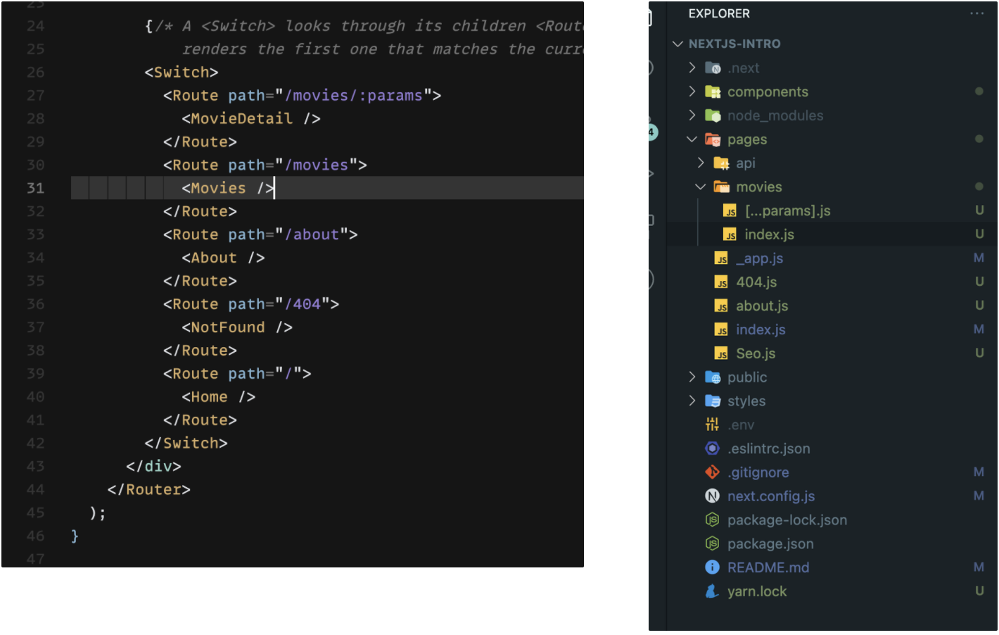

# React vs Next.js

Status: In progress
Tags: react


## Library? Framework?

> 간단히 비유하면, 프레임워크는 **집**이고 라이브러리는 집 안에 있는 **가구들**이라고 보면 된다.

React.js는 UI를 만들기 위한 **라이브러리**이다. 라이브러리 의미는 어떠한 기능을 수행하기 위해 필수적인 도구들을 미리 제공한 것들을 말한다.

리액트로 예를 들면, **UI를 만들기 위한 기능**을 수행하기 위해 컴포넌트 단위의 UI를 만드는 도구가 있고(Class Component, Functional Component), 외부에서 오는 데이터에 따라 UI를 변경하는 도구가 있다(예를 들어, setState)

반면, Nextjs는 **React Framework**라고 소개된다. Framework는 이미 만들어진 라이브러리에서 자주 사용하는 기능들을 재사용할 수 있게 만든 **정해진 틀**이다. 정해진 틀이라는 의미는 하나의 기능을 구현하기 위해선 하나의 규칙만을 사용해야 한다는 약속들을 사용자에게 주는 것과 같다. 이번 발표는 Next.js가 제공하는 약속, 즉 기능을 소개해보고 React.js와의 차이는 무엇이 있는지 알아보자.

## Nextjs가 제공하는 기능

### 1. 렌더링 방식

- 기본적으로 Next.js는 **Pre-render** 방식이다. Pre-render 방식에는 2가지가 있는데, **Static Generation Rendering**, **Server Side Rendering**이 있다.
- Pre-render 방식은 미리 HTML 코드를 만들고 나서 웹앱이 실행되기 때문에 웹 크롤러가 HTML 코드를 쉽게 찾아낼 수 있다. → SEO 최적화
- 리액트는 기본적으로 Client Side Rendering 방식이다. 즉, HTML 코드가 만들기 전 리액트 웹앱이 먼저 실행된다. → HTML 코드가 없으므로 웹 크롤러는 HTML을 찾아내기 어렵다 → SEO에 불리.
- 그리고 2가지 Pre-render 방식 중 Static Generation Rendering이 기본으로 작동한다.

  ### Static Generation Rendering

  - Static Generation Rendering은 **빌드타임 때** HTML 페이지를 미리 만드는 방식이다.
  - 빌드타임 이라는 의미는 말 그대로 `yarn build`라는 명령어를 실행했을 때 HTML이 만들어지는 의미다.
  - 의문이 생길 것이다. `yarn build`는 실행하는 데 오래 걸리는데 코드 수정할 때마다 _시간이 오래 걸리는_ HTML 빌드를 해야 한다는 의미인가?
  - Next.js는 이미 만들어진 페이지가 **캐싱**이 되기 때문에 미리 렌더링 되었던 페이지를 다시 들어갈 때 페이지 로드 속도가 훨씬 빠르다.

  ### Static Generation Rendering이 적용된 컴포넌트 예제

  ```jsx
  function Blog({ posts }) {
    return (
      <ul>
        {posts.map((post) => (
          <li>{post.title}</li>
        ))}
      </ul>
  }

  // This function gets called at build time
  export async function getStaticProps() {
    // Call an external API endpoint to get posts
    const res = await fetch('https://.../posts')
    const posts = await res.json()

    // By returning { props: { posts } }, the Blog component
    // will receive `posts` as a prop at build time
    return {
      props: {
        posts,
      },
    }
  }

  export default Blog
  ```

  - Static Generation Rendering을 사용하기 위해선 `getStaticProps`라는 Next.js에서 제공하는 함수를 사용해야 한다.
    위의 예제의 흐름은 다음과 같다.

  1. `getStaticProps()`를 먼저 실행해서 외부의 데이터를 가져온다.
  2. `getStaticProps()`에서 리턴한 값은 Blog 컴포넌트의 props에서 받아온다.
  3. Blog 컴포넌트를 렌더링한다.

  ### Server Side Rendering

  - Server Side Rendering은 서버에서 HTML 코드를 생성하는 방식이다. → _서버에서 HTML 코드를 생성한다는 말은 솔직히 와 닿지 않는다._
  - 가장 큰 특징은 Server Side Rendering은 **사용자가 해당 컴포넌트에 들어갈 때에만** HTML 파일을 생성하는 방식이다.
  - 빌드 타임 때 다른 컴포넌트들의 HTML이 만들어졌어도 Server Side Rendering이 적용된 컴포넌트는 사용자가 컴포넌트를 보여달라고 하기 전까지는 만들어지지 않는다.

  ### Server Side Rendering이 적용된 컴포넌트 예제

  ```jsx
  function Page({ data }) {
    // Render data...
  }

  // This gets called on every request
  export async function getServerSideProps() {
    // Fetch data from external API
    const res = await fetch(`https://.../data`);
    const data = await res.json();

    // Pass data to the page via props
    return { props: { data } };
  }

  export default Page;
  ```

  - Server Side Rendering을 이용하기 위해서 `getServerSideProps()`라는 함수를 사용해야 한다.
  - 위 예제의 흐름은 Static Generation Rendering의 예제와 같다.
  - 하지만 다른 점은 `getServerSideProps`는 빌드타임에 작동하지 않고 사용자가 요청할 때에만 작동한다.
    - 이런 특징은 웹 앱의 성능 향상에 도움이 된다. 왜냐하면 아주 많은 양의 데이터를 요청하는 컴포넌트를 렌더링할 때에만 시간이 걸리고 다른 컴포넌트 렌더링 속도에는 영향을 주지 않기 때문이다.
    - 하지만 기본적으로 Server Side Rendering은 요청할 때마다 HTML 코드가 생성하기 때문에 **아이러니하게도** 성능 향상에 방해가 된다.
      ⇒ Static Generation Rendering과 Server Side Rendering을 적절하게 섞어서 사용해야 한다.
      > \***\*Static rendering is eager, server rendering is lazy\*\***

  ### 그래서 언제 뭘 사용해야하는 건가?

  - Next.js 문서에서는 보통 Static Generation Rendering을 사용하는 것을 추천한다.
  - 하지만 다음과 같은 경우에 Server Side Rendering을 추천한다고 한다.
    - 서버 API에 데이터를 빈번하게 요청 or 업데이트를 할 경우
      - 예시: 페이스북에서 내린 스크롤이 끝에 다다랐을 때 데이터 요청
    - 어떤 사용자에 따라 서버에서 주는 Response가 달라야 할 경우

### 2. 폴더구조 기반의 라우팅

Next.js는 파일 구조 기반의 라우팅을 제공한다.

리액트에서는 `react-router-dom` 라이브러리를 사용해서 개발자가 하나씩 하나씩 라우팅을 코딩해야 했다.

하지만 Next.js는 폴더 트리에 따라 라우터가 정해진다.

아래 사진에서 왼쪽은 리액트로 라우터를 코딩한 것이고 오른쪽은 Next.js의 폴더 구조이다.



### Next.js에서 라우팅 설정 방법

- Next.js에서는 ‘page’ 폴더 안에 컴포넌트 파일을 만들면 Next.js가 라우터를 만들고 라우터 경로는 파일 이름이 된다.
- 왼쪽 `<Route path='/' />`, `<Route path='/404' />`, `<Route path='/about' />` 은 오른쪽 사진에서 ‘page’ 폴더에 `index.js`, `404.js`, `about.js`라는 파일을 만들면 자동으로 라우팅이 생성이 된다.

### 파라미터가 있는 라우팅 설정

- `<Route path='/movies/:params' />`은 오른쪽 ‘page’폴더 안에 있는 `movies/[params].js`으로 파일이름을 지으면 파라미터가 있는 라우터가 설정이 된다.
- 파라미터가 있는 라우팅 설정할 때 파일이름에 대괄호를 써야한다. 그래야 Next.js가 해당 컴포넌트에 파라미터가 있다는 것으로 간주한다.
- 파라미터는 `query` 오브젝트를 통해 접근 할 수 있다.
- `/movies/[params].js`인 Route에서 대괄호 안에 3개 점을 넣으면 배열 형태로 여러 개의 파라미터를 받아 올 수 있다.
  - `/movies/bat-mans` => `{ params: ['bat-mans'] }`
  - `/movies/bat-mans/dc-comics` => `{ params: ['bat-mans', 'dc-comics'] }`

```jsx
import { useRouter } from "next/router";

const Post = () => {
  const router = useRouter();
  const { params } = router.query;
  // params가

  return <p>Post: {params}</p>;
};

export default Post;
```

### 3. 이미지 최적화 (Image Optimization)

### Native  태그 VS Next.js에서 제공하는 <Image /> 컴포넌트

- 화소 최적화
  - 네이티브  태그로 이미지를 가져올 때 화소가 깨질 때가 있다.
  - 예를 들어, 가져오려는 이미지의 크기가 브라우저 사이즈보다 클 때 밑의 예시처럼 내가 원하지 않은 이미만 볼 수 있다.
  - Next.js의 <Image /> 컴포넌트를 사용하면 우리가 원하는 이미지를 볼 수 있도록 브라우저 크기에 맞게 자동으로 이미지 크기를 조정해준다. ⇒ 기본으로 반응형 이미지를 제공한다.
    

### - Next.js의 이미지 컴포넌트를 이용한 코드 예제

```jsx
import React from "react";
import Image from "next/image";
import bgImage from "../public/img_unsplash.jpg";

export default function About() {
  return (
    <div>
      <h1>Built-in Image Component provided by Next.js</h1>
      <Image src={bgImage} /> // !!!!!Attention!!!!!!
      <h1>Native Image Tag</h1>
      
    </div>
  );
}
```

여기서 주목해야 할 점은 `<Image />` 컴포넌트가 HTML 코드로 어떻게 변환하는지이다.


네이티브  태그 주위에 <span /> 태그로 감싸져 있다(주변 HTML 태그에 따라 <div />로도 감싸져있을 수 있다). 그리고 이미지를 최적화하기 위해 Next.js가 span 태그에 스타일 속성을 주었다.

⇒ **Next.js가 알아서 다 해준다.**

### Lazy Loading

- 기본적으로 Next.js의 <Image />는 Lazy Loading을 한다.
- 이미지를 미리 로딩하지 않고 기다리고 있다가 사용자가 필요할 때에 로딩을 한다
- 앱의 성능 향상을 가져올 수 있다.
- 하지만 원하면 이미지를 미리 로딩 할 수 있는 Eager Loading도 할 수 있다.

```jsx
<Image
  src={bgImage}
  layout="responsive"
  loading="eager" // loading="lazy"
/>
```

### Placeholder

- Placeholder는 이미지를 처음 로딩할 때 이미지를 흐리게하는 것이다.
- 기본적으로 <Image /> 컴포넌트는 흐릿한 Placeholder로 작동한다.
  .gif>)
- Placeholder를 흐릿하게 할 지 안 나타나게 할 지 정할 수 있다.

```jsx
// Placeholder 사용
<Image src={bgImage} layout="responsive" placeholder="blur" />
// Placeholder 해제
<Image src={bgImage} layout="responsive" placeholder="empty" />
```

**출처**

- [리액트 공식 홈페이지](https://ko.reactjs.org/)
- [Nextjs 공식 홈페이지](https://nextjs.org/)
- [프레임워크와 라이브러리의 차이](https://juyeop.tistory.com/23)
- [Static vs Server Rendering](https://frontarm.com/james-k-nelson/static-vs-server-rendering/)
- [Next.js Image Optimization Techniques](https://uploadcare.com/blog/next-js-image-optimization/)
